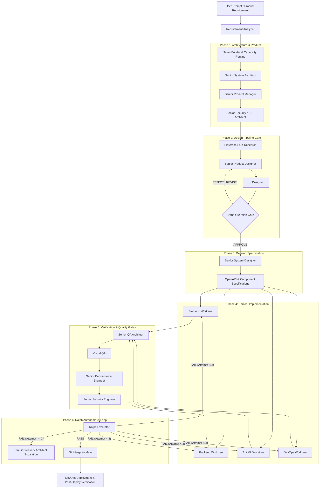

# Orca — Autonomous Engineering Operating System

[](https://gemini.google.com)
[](#-agent-organization)
[](#-production-readiness-standards)
[](#-production-readiness-standards)
[](LICENSE)

**Orca** is an autonomous multi-agent software engineering operating system built for Google Antigravity. It orchestrates a specialized squad of 29 senior domain architects, engineers, design researchers, and quality evaluators to transform high-level product briefs into production-grade, venture-backed standard applications.

Every system Orca builds is **SEO-optimized**, **Conversion-Rate Optimized (CRO)**, **sub-second fast**, **zero-vulnerability secure**, and verified by an evidence-based autonomous evaluation loop.

---

## 🌟 Core Pillars

- **Autonomous Squad Assembly**: Dynamic capability routing analyzes product prompts and activates only the minimal optimal squad of senior specialists.
- **Strict Authority Boundaries**: Senior agents own decisions and architectural gates; worker subagents execute isolated tasks in parallel Git worktrees.
- **Mandatory Brand & Design Gate**: Features a dedicated visual design pipeline (`Pinterest` → `UX` → `Product Designer` → `Brand Guardian Gate` → `Visual QA`) enforcing modern aesthetics (glassmorphism, vibrant HSL palettes, dark modes, dynamic micro-animations) while prohibiting third-party copycat designs.
- **Production Readiness Built-In**: Technical SEO (SSR, JSON-LD, meta tags, sitemaps), CRO (above-fold CTAs, trust signals, friction-free flows), and performance budgets (LCP < 2.5s, INP < 200ms, CLS < 0.1) are baked into every phase.
- **Ralph Autonomous Loop**: A closed-loop execution harness with evidence-based evaluation, 3-retry circuit breakers, and automatic regression rollback.

---

## 🏗️ System Architecture & Workflow



---

## 👥 Agent Organization

Orca features 29 pre-configured subagent roles with YAML frontmatter metadata (`subagent: true`), clear authority boundaries, inputs, outputs, and escalation protocols:

### Core Architecture & Strategy
| Agent | Role & Responsibility |
| :--- | :--- |
| [`requirement-analyzer`](agents/requirement-analyzer.md) | Entry point: extracts capabilities, SEO needs, CRO funnels, and activates senior squad. |
| [`senior-system-architect`](agents/senior-system-architect.md) | System topology, ADRs, rendering strategy (SSR/SSG/ISR), and caching architecture. |
| [`senior-system-designer`](agents/senior-system-designer.md) | Component contracts, OpenAPI 3.1 specifications, entity relationships, sequence flows. |
| [`senior-product-manager`](agents/senior-product-manager.md) | PRDs, user stories, acceptance criteria, SEO content strategy, analytics taxonomy. |
| [`senior-cloud-architect`](agents/senior-cloud-architect.md) | Landing zones, multi-cloud topologies, FinOps cost modeling, disaster recovery. |
| [`senior-database-architect`](agents/senior-database-architect.md) | Relational & vector schemas (pgvector), index optimization, zero-downtime migrations. |

### Software Engineering & Operations
| Agent | Role & Responsibility |
| :--- | :--- |
| [`senior-frontend-engineer`](agents/senior-frontend-engineer.md) | Modern web UI, SSR/SEO rendering, Core Web Vitals, conversion components, WCAG AA. |
| [`senior-backend-engineer`](agents/senior-backend-engineer.md) | Sub-200ms APIs, Redis/CDN caching, rate-limiting, sitemaps, structured logging. |
| [`senior-devops-engineer`](agents/senior-devops-engineer.md) | CI/CD pipelines, container hardening, zero-downtime deployments, infrastructure as code. |
| [`senior-security-engineer`](agents/senior-security-engineer.md) | Threat modeling (STRIDE), zero-trust auth, SAST/DAST audits, security header enforcement. |

### Quality & Verification
| Agent | Role & Responsibility |
| :--- | :--- |
| [`senior-qa-architect`](agents/senior-qa-architect.md) | Test pyramid lead (Unit ≥80%, Integration, E2E Playwright, API contract tests). |
| [`senior-performance-engineer`](agents/senior-performance-engineer.md) | Lighthouse CI enforcement (Perf ≥90), load testing (k6), bundle budget enforcement. |
| [`visual-qa`](agents/visual-qa.md) | Multi-viewport screenshot diffs (375px–1920px), dark mode audits, animation CLS checks. |

### Visual Design Pipeline & Brand Gate
| Agent | Role & Responsibility |
| :--- | :--- |
| [`pinterest-researcher`](agents/pinterest-researcher.md) | Visual trend extraction, color palette swatches, lighting & typography inspiration. |
| [`design-researcher`](agents/design-researcher.md) | Competitor UI benchmarks, interaction ergonomics, pattern extraction. |
| [`ux-researcher`](agents/ux-researcher.md) | Persona modeling, user journey mapping, cognitive walkthrough friction analysis. |
| [`senior-product-designer`](agents/senior-product-designer.md) | Information architecture, wireframes, design token taxonomy, component specs. |
| [`ui-designer`](agents/ui-designer.md) | High-fidelity component states, micro-interactions, conversion UI elements. |
| [`brand-guardian`](agents/brand-guardian.md) | **MANDATORY GATE**: Brand compliance, 5-dimension visual scorecard, originality lock. |

### AI, ML & Data Engineering Specialists
| Agent | Role & Responsibility |
| :--- | :--- |
| [`senior-ai-engineer`](agents/senior-ai-engineer.md) | Multi-agent coordination topologies, reasoning frameworks, guardrail policies. |
| [`senior-llm-engineer`](agents/senior-llm-engineer.md) | Production RAG pipelines, fine-tuning (PEFT/LoRA), function calling, LLM evals. |
| [`senior-nlp-engineer`](agents/senior-nlp-engineer.md) | Tokenization, semantic dense/sparse retrieval (BM25 + ColBERT), NER, cross-encoders. |
| [`senior-deep-learning-engineer`](agents/senior-deep-learning-engineer.md) | PyTorch architectures, distributed training (DDP/FSDP), quantization (INT8/AWQ). |
| [`senior-machine-learning-engineer`](agents/senior-machine-learning-engineer.md) | Tabular ML (XGBoost/CatBoost), feature engineering, SHAP explanations, seed locking. |
| [`senior-generative-ai-engineer`](agents/senior-generative-ai-engineer.md) | Diffusion models (FLUX/SDXL), ControlNet, audio/video synthesis, ComfyUI APIs. |
| [`senior-computer-vision-engineer`](agents/senior-computer-vision-engineer.md) | Object detection (YOLO/DETR), segmentation (SAM), OCR, tracking, TensorRT edge. |
| [`senior-ai-research-engineer`](agents/senior-ai-research-engineer.md) | Scientific paper reproduction, novel loss formulations, rigorous ablation studies. |
| [`senior-mlops-engineer`](agents/senior-mlops-engineer.md) | High-throughput model serving (vLLM/Triton), model registry, data/concept drift alerts. |
| [`senior-data-engineer`](agents/senior-data-engineer.md) | Distributed batch/stream ETL (Spark/Flink/dbt), lakehouses (Delta/Iceberg), data quality. |

---

## 🎯 Production Readiness Standards

Orca enforces hard criteria that block execution if quality budgets are breached:

### 1. Performance Budgets (Core Web Vitals)
- **Lighthouse Performance Score**: $\ge 90$ (Mobile 4G simulation)
- **Largest Contentful Paint (LCP)**: $< 2.5\text{s}$
- **Interaction to Next Paint (INP)**: $< 200\text{ms}$
- **Cumulative Layout Shift (CLS)**: $< 0.1$
- **Time to First Byte (TTFB)**: $< 200\text{ms}$
- **Initial JS Bundle**: $< 200\text{KB}$ gzipped

### 2. SEO Compliance
- Mandatory Server-Side Rendering (SSR/SSG) for all public pages.
- Unique `<title>` (50–60 chars) & `<meta description>` (150–160 chars) per page.
- Valid JSON-LD structured data (Organization, Product, BreadcrumbList, FAQ).
- Canonical URLs, Open Graph tags, automated `sitemap.xml`, clean `robots.txt`.

### 3. Conversion Rate Optimization (CRO)
- Primary CTA visible above the fold on all landing pages.
- Trust signals (testimonials, partner logo bars, security badges) placed near decision points.
- Form fields minimized with progressive disclosure and inline real-time validation.
- Skeleton loading screens (zero spinners) to prevent layout shifts.

### 4. Security & Quality
- Zero exposed secrets or hardcoded API keys.
- Rate limiting and CSRF protection on state-changing endpoints.
- Response security headers: `Content-Security-Policy`, `Strict-Transport-Security`, `X-Frame-Options`.
- Unit test branch coverage $\ge 80\%$, zero lint errors, zero TypeScript errors.

---

## ⚡ Quick Start

### 1. Clone the Repository
```bash
git clone https://github.com/akramrafid/codingWorkflow_orca.git
cd codingWorkflow_orca
```

### 2. Validate Agent Definitions
Run the built-in PowerShell validation engine to check YAML frontmatter and required sections across all 29 agents:
```powershell
.\scripts\validate-agents.ps1
```

### 3. Install Global Antigravity Agents
Synchronize Orca agents directly into your Antigravity global configuration (`~/.gemini/config/agents/`):
```powershell
.\scripts\install-agents.ps1
```

### 4. Run the Ralph Autonomous Execution Loop
To run autonomous feedback-driven task execution:
```powershell
.\ralph\loop.ps1 -StateFile .\ralph-state.json -TaskFile .\tasks.json -MaxIterations 30
```

---

## 📂 Project Structure

```
codingWorkflow_orca/
├── ARCHITECTURE.md                  # Master architecture constitution & readiness checklist
├── agents/                          # 29 specialist & senior subagent definitions
│   ├── requirement-analyzer.md      # Entry point requirement extraction & capability mapping
│   ├── senior-system-architect.md   # High-level architecture, rendering & caching
│   ├── senior-frontend-engineer.md  # SSR, SEO, performance & WCAG UI implementation
│   ├── brand-guardian.md            # Mandatory visual & brand gatekeeper
│   └── ...                          # 25 additional specialized agent definitions
├── routing/                         # Capability routing & model selection engine
│   ├── capability-matrix.yaml       # Domain to agent squad mapping rules
│   ├── domain-rules.yaml            # Authority hierarchies & veto policies
│   ├── model-capability-matrix.yaml # Model assignment by domain & complexity
│   ├── routing-policy.md            # Multi-phase execution & handoff protocols
│   ├── task-classifier.md           # Domain, complexity tier & risk classifier
│   └── team-builder.md              # Dynamic squad provisioning algorithm
├── ralph/                           # Ralph autonomous feedback & execution loop
│   ├── loop.ps1                     # PowerShell execution harness
│   ├── evaluator.md                 # 27-point objective evaluation rubric
│   ├── policies.md                  # Circuit breaker, retry & rollback policies
│   ├── state-schema.json            # State tracking schema
│   └── task-schema.json             # Task execution schema
├── harness/                         # Antigravity CLI runner & model integration
│   ├── antigravity-runner.ps1       # CLI automation runner
│   ├── registry.yaml                # Model harness registry
│   └── harness-schema.json          # Harness schema
├── policies/                        # Global agent rules & governance
│   └── AGENT_RULES.md               # 12 non-negotiable global agent rules
├── scripts/                         # Automation & validation scripts
│   ├── validate-agents.ps1          # Agent frontmatter validator
│   └── install-agents.ps1           # Global Antigravity sync script
└── mcp/                             # Model Context Protocol configurations
    └── mcp_config.template.json     # Workspace MCP server template
```

---

## 📄 License

Distributed under the MIT License. See [`LICENSE`](LICENSE) for details.

---

<p align="center">
  Built with ❤️ for <b>Google Antigravity</b>
</p>
